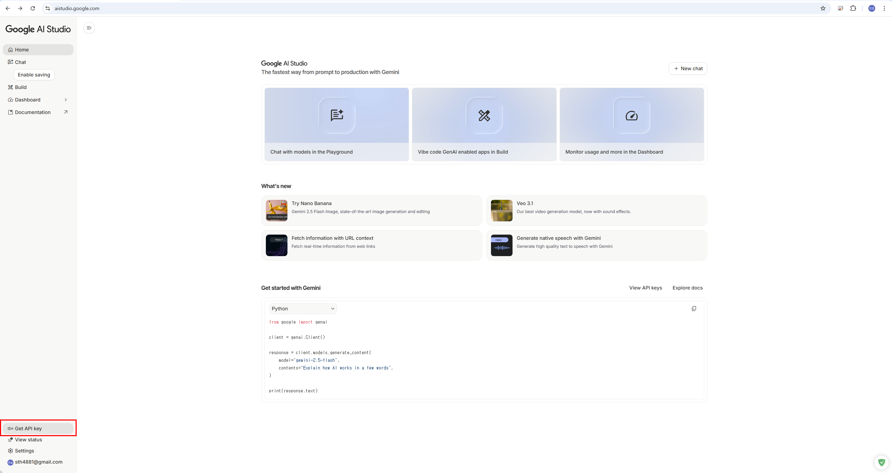
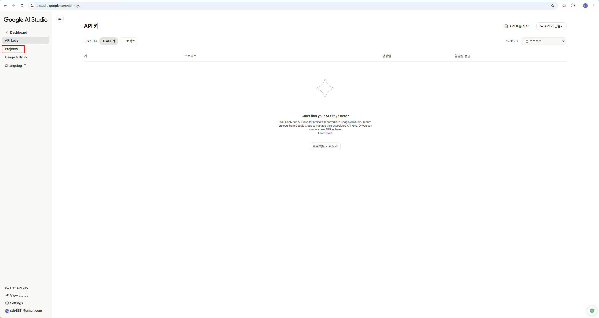
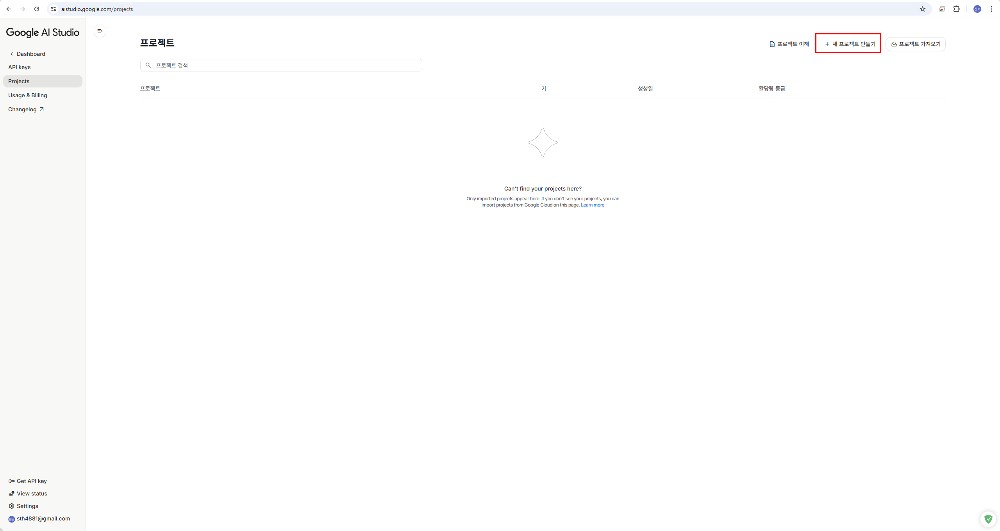
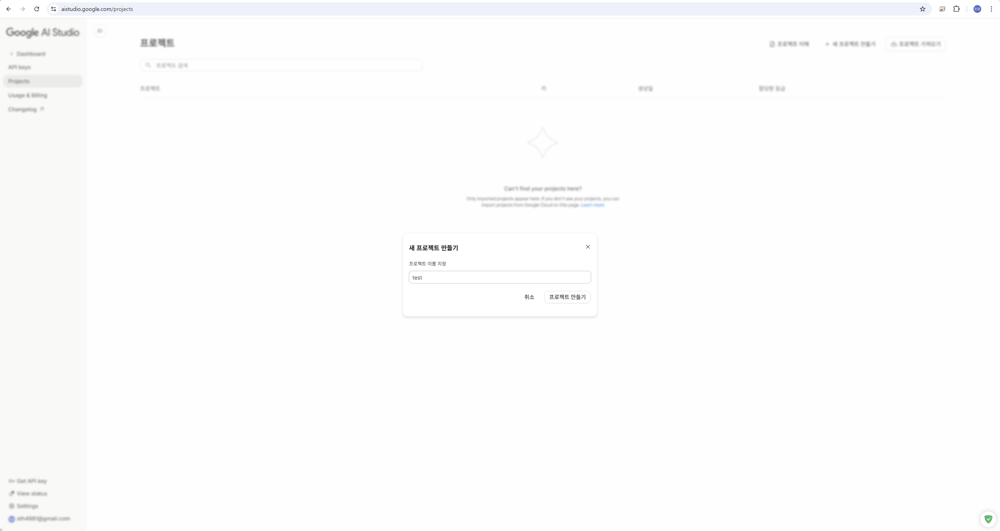
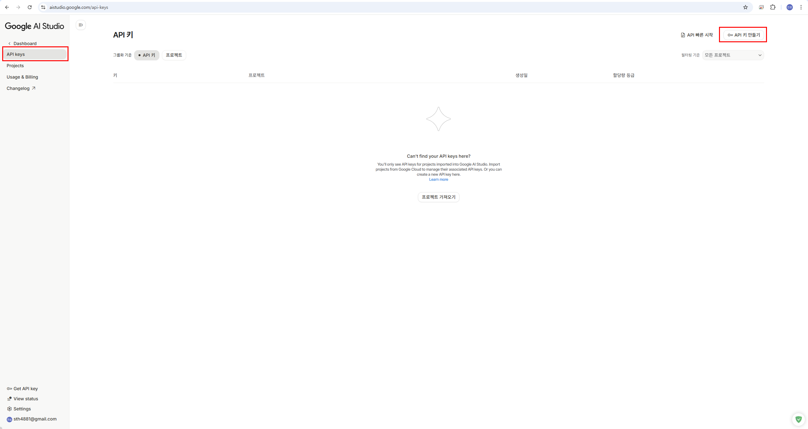
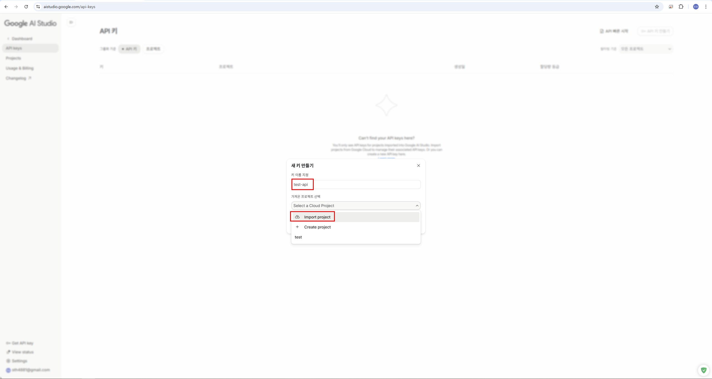
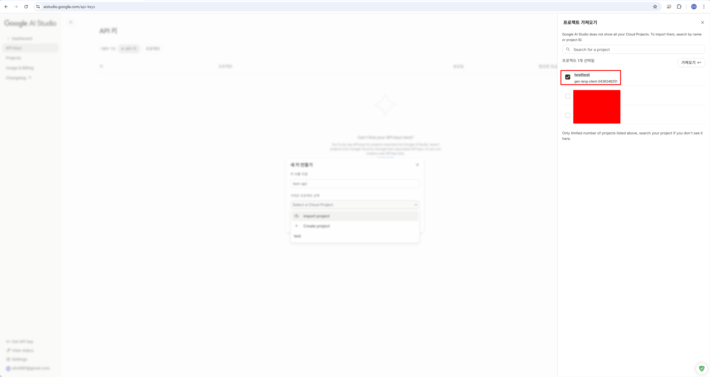
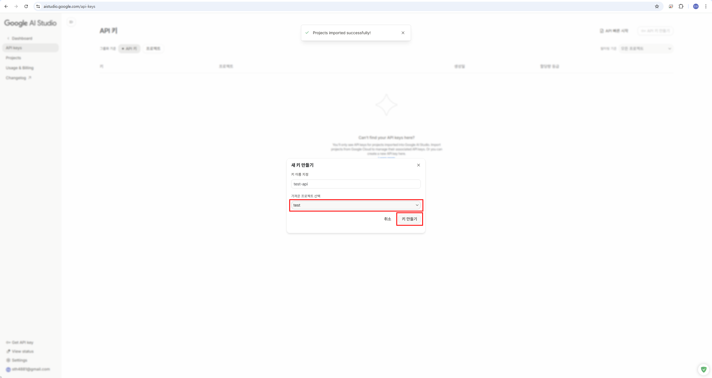
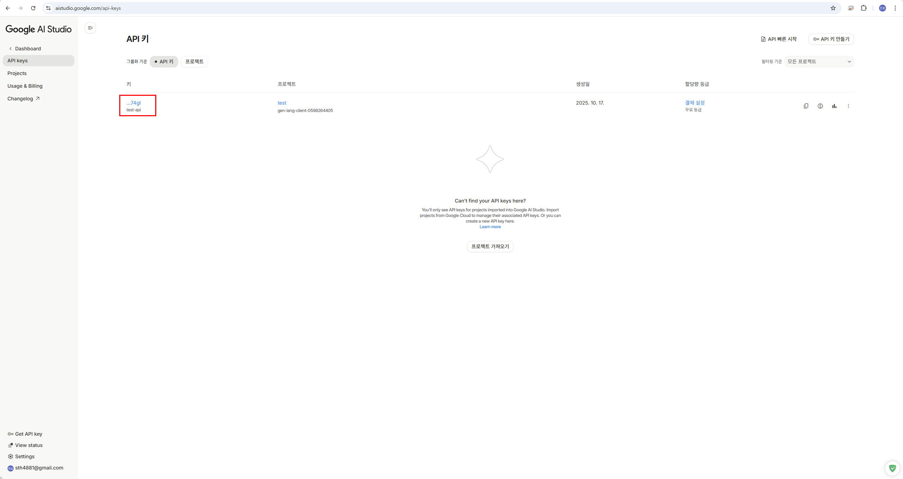
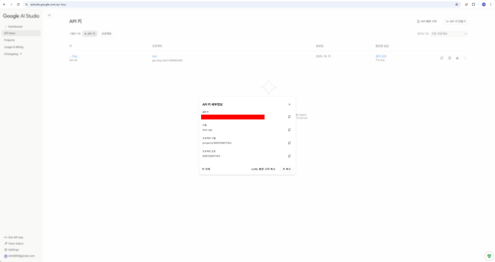

# VibeCraft-Code

**VibeCraft-Code**는 사용자 정의 주제를 기반으로 데이터 인과관계 분석 및 시각화 웹 페이지를 자동 생성하는 파이프라인입니다. **Claude**, **OpenAI GPT**, **Gemini**와 같은 대규모 언어 모델(LLM)을 **MCP (Model Context Protocol)** 생태계와 통합하여 주제 선택부터 웹 페이지 코드 생성까지 전체 워크플로우를 간소화합니다.

---

## 🚀 Overview

이 프로젝트는 데이터 인과관계 분석을 위한 자동화된 워크플로우로 구성됩니다:

1. **주제 정의 (Topic Definition)**
   - 사용자 프롬프트를 받아 AI 모델(Claude/GPT/Gemini)을 사용하여 분석 주제를 생성하고 정형화합니다.
   - 주제는 MCP 도구를 통해 다운스트림 모듈로 전달됩니다.

2. **데이터 수집 또는 업로드 (Data Collection/Upload)**
   - 사용자가 데이터를 제공하면 CSV 또는 SQLite 형식으로 저장됩니다.
   - 데이터가 업로드되지 않은 경우, 시스템이 자동으로 웹에서 주제 관련 데이터를 검색하고 스크래핑하여 로컬에 저장합니다.

3. **데이터 전처리 및 인과관계 분석 (Data Processing & Causal Analysis)**
   - 수집된 데이터를 자동으로 전처리합니다 (컬럼 정제, 영문 변환 등).
   - RAG(Retrieval-Augmented Generation)를 활용하여 학술 논문 기반의 인과관계 분석을 수행합니다.
   - 데이터 간의 상관관계, 인과관계, 영향도 등을 분석합니다.

4. **시각화 타입 선택 및 코드 생성 (Visualization & Code Generation)**
   - 분석 결과를 기반으로 최적의 시각화 타입을 자동으로 결정합니다.
   - 시각화, 레이아웃 구조 및 UI 컴포넌트를 포함한 완전한 웹 페이지를 생성합니다.

5. **자동 배포 (Auto Deployment - WIP)**
   - 생성된 웹 페이지를 `deploy_client`를 사용하여 **Vercel** 플랫폼에 자동 배포합니다.
   - 배포가 완료되면 사용자는 게시된 웹 페이지에 액세스할 수 있는 URL을 받습니다.

---

## 🧰 MCP & Environment Setup

이 프로젝트는 [Model Context Protocol (MCP)](https://modelcontextprotocol.io/introduction)을 기반으로 구축되었으며, 구조화된 프로토콜을 통해 클라이언트와 도구 간의 모듈식 통신을 가능하게 합니다.

### 🔌 MCP Components

- **MCP Server**: 특정 기능(예: 파일 I/O, HTTP 호출, 데이터베이스 작업)을 도구를 통해 제공합니다.
- **MCP Client**: MCP 서버와 상호 작용하여 요청을 보내고 구조화된 응답을 받습니다.

### 🛠 Environment Setup

#### 1. 저장소 클론
```bash
git clone https://github.com/vibecraft25/vibecraft-code.git
cd vibecraft-code
```

#### 2. [`uv`](https://github.com/astral-sh/uv) 설치 (Python 프로젝트 매니저)
```bash
# Windows
powershell -c "irm https://astral.sh/uv/install.ps1 | iex"
# MacOS/Linux
curl -LsSf https://astral.sh/uv/install.sh | sh
```

#### 3. 가상 환경 생성 및 활성화
```bash
uv venv --python=python3.12

# Windows
.venv\Scripts\activate
# MacOS/Linux
source .venv/bin/activate

uv init
```

#### 4. 의존성 설치
```bash
# pyproject.toml과 uv.lock을 기반으로 모든 의존성 자동 설치
uv sync
```
**설치되는 주요 패키지**:
- `langchain`, `langchain-anthropic`, `langchain-google-genai` - AI 모델 통합
- `mcp[cli]` - Model Context Protocol 클라이언트
- `chromadb`, `sentence-transformers` - RAG 벡터 데이터베이스
- `pandas`, `numpy` - 데이터 처리

#### 5. Node.js 확인 (MCP 서버용)
```bash
# Download and install Node.js from the official website:
# 👉 https://nodejs.org
npm -v
npm install -g @google/gemini-cli
npm install -g vibecraft-agent
```

#### 6. 프로젝트 설정 구성
필요시 `config-development.yml`을 환경에 맞게 수정하세요.
```text
```yaml
version:
  server: "1.0.0"

resource:
  data: "[YOUR_PATH]/vibecraft-code/storage"
  mcp: "[YOUR_PATH]/vibecraft-code/mcp_agent/servers"

path:
  chat: "./chat-data"            # 채팅 기록
  file: "./data-store"           # 처리된 파일
  chroma: "./chroma-db"          # RAG 벡터 데이터베이스

log:
  path: "./vibecraft-code-python-log"
```

**중요 설정 사항:**
- `resource.data`: 사용자가 업로드한 파일 및 분석 결과가 저장되는 경로
- `resource.mcp`: MCP 서버 설정 파일들이 위치한 경로
- `path.chat`: 대화 기록이 저장되는 디렉토리
- `path.file`: 업로드된 파일 및 처리된 데이터가 저장되는 디렉토리
- `path.chroma`: ChromaDB 벡터 데이터베이스용 디렉토리 (RAG 엔진에서 사용)
- 모든 상대 경로는 프로젝트 루트에서 해석됩니다

#### 7. 환경 변수 설정
**⚠️ .env 파일을 공유하거나 커밋하지 마세요. 민감한 자격 증명이 포함되어 있습니다. ⚠️**
```bash
# .env.example을 복사
# Windows
copy .env.example .env
# MacOS/Linux
cp .env.example .env
```
생성된 `.env` 파일을 열어 실제 API 키를 입력하세요:
```bash
# .env
OPENAI_API_KEY=your_openai_api_key_here
ANTHROPIC_API_KEY=your_anthropic_api_key_here
GEMINI_API_KEY=your_gemini_api_key_here
GOOGLE_API_KEY=your_google_api_key_here
```

### 🔑 GEMINI API KEY 발급 방법

#### 1.Google AI Studio(https://aistudio.google.com) 접속 후 Get API key 클릭


#### 2. Projects 들어가서 '새 프로젝트 만들기' - 입력한 이름으로 프로젝트 생성
 |  | 
-----------------|------------------|----------------|

#### 3. API keys 들어가서 'API 키 만들기' - 키 이름 지정 - 가져올 프로젝트 선택 (Import project)
 |  |  |
-----------------|------------------|------------------|

#### 4. 프로젝트 선택 후 '키 만들기' 결과로 API 키 생성 완료
 |  | 
-----------------|------------------|------------------|

---

## 🧠 Engine Architecture

각 엔진은 `BaseEngine`을 통해 공통 인터페이스를 구현합니다:

- `ClaudeEngine` – Anthropic Claude 사용 - [claude-3-5-sonnet-20241022]
- `OpenAIEngine` – OpenAI GPT 사용 - [gpt-4.1]
- `GeminiEngine` – Google Gemini 사용 - [gemini-2.5-flash]

각 엔진은 다음을 지원합니다:
- 다중 턴 대화
- MCP를 통한 동적 도구 호출
- 텍스트 및 함수 응답 처리
- RAG 기반 학술 논문 검색 및 분석

---

## 🔧 RAG Engine Setup

**VibeCraft는 학술 논문 기반의 인과관계 분석을 위해 RAG(Retrieval-Augmented Generation) 엔진을 사용합니다.**

### RAG 엔진 인스턴스 생성

```python
from services.data_processing.rag_engine import RAGEngine

# RAG 엔진 초기화
rag_engine = RAGEngine(
    collection_name="documents",      # ChromaDB 컬렉션 이름
    chunk_size=800,                   # 인덱싱을 위한 텍스트 청크 크기
    chunk_overlap=100,                # 청크 간 겹침
    persist_directory="./chroma-db"   # 벡터 DB 저장 경로
)
```

### RAG 문서 추가

```python
# 본인의 로컬 프로젝트 RAG 문서 디렉토리에 맞게 경로 수정 (rag_engine.py)
result = rag_engine.add_documents_from_directory("C:/Users/YourUsername/path/to/vibecraft-code/storage/documents")
```

### 문서 검색

```python
# 관련 콘텐츠 검색
results = rag_engine.search("매출 및 판매 수익에 영향을 미치는 요인은 어떤 것들이 있나요?", k=5)

for result in results:
    print(f"파일: {result.file_path}")
    print(f"내용: {result.content}")
    print(f"유사도 점수: {result.score}")
    print(f"메타데이터: {result.metadata}")
    print("---")
```

### 지원되는 파일 타입

RAG 엔진은 다음 문서 형식을 지원합니다:
- **텍스트**: `.txt`, `.md`
- **PDF**: `.pdf`
- **Office**: `.docx`, `.xlsx`, `.pptx`
- **코드**: `.py`, `.js`, `.java`, `.cpp`, etc.

### RAG 엔진 API

| 메서드 | 설명 | 파라미터 |
|--------|------|----------|
| `add_document(file_path)` | 단일 문서 인덱싱 | `file_path`: 파일 경로 |
| `add_documents_from_directory(dir_path)` | 디렉토리의 모든 지원 파일 인덱싱 | `dir_path`: 디렉토리 경로 |
| `search(query, k)` | 관련 문서 검색 | `query`: 검색 쿼리<br>`k`: 결과 개수 |
| `delete_document(file_path)` | 인덱스에서 문서 제거 | `file_path`: 파일 경로 |
| `reset()` | 인덱싱된 모든 문서 삭제 | None |
| `get_documents_count()` | 인덱싱된 문서 총 개수 조회 | None |

---

## ⚙️ How It Works

### 파이프라인 실행

1. `main.py`에서 모델 설정 (예시)
```python
# 모델 선택: "claude" or "gemini" or "gpt"
engine = "gemini"
client = VibeCraftClient(engine)
```

2. 자동화된 파이프라인 실행 (예시)
```python
await client.run_pipeline(
    topic_prompt="서울시를 기준으로 음식 분류별 맛집 리스트를 시각화하는 페이지를 만들어줘",
    file_path="./samples/dining.csv"
)
```

### 파이프라인 단계

파이프라인은 다음 단계를 자동으로 실행합니다:

1. **주제 선택** - 사용자 프롬프트를 구조화된 주제로 정형화
2. **데이터 업로드** - 제공된 데이터 파일 로드 및 검증
3. **데이터 처리** - 데이터 정제, 정규화 및 컬럼명 번역
4. **인과관계 분석** - RAG를 사용하여 데이터 관계 분석
5. **시각화 추천** - AI 기반 차트 타입 선택
6. **코드 생성** - 완전한 웹 애플리케이션 코드 생성

### 예제 출력

```bash
$ python main.py

--- Optimized Data Analysis LangGraph ---
                              +-----------+
                              | __start__ |
                              +-----------+
                                    *
                                    *
                                    *
                                +-------+
                              ..| agent |..
                          ....  +-------+  ....
                     .....         .           .....
                 ....              .                .....
              ...                 .                      ....
     +-------+                    .                          ...
     | tools |                    .                            .
     +-------+                    .                            .
          .                       .                            .
          .                       .                            .
          .                       .                            .
  +--------------+                .                            .
  | rag_analysis |                .                            .
  +--------------+                .                            .
          *                       .                            .
          *                       .                            .
          *                       .                            .
+-----------------+               .               +------------------------+
| final_synthesis |               .               | summarize_conversation |
+-----------------+**              .              +------------------------+
                     *****         .            *****
                          ****      .       ****
                              ***   .    ***
                               +---------+
                               | __end__ |
                               +---------+

🎤 주제를 입력하세요: (예: 서울시를 기준으로 음식 분류별 맛집 리스트를 시각화하는 페이지를 만들어줘)
🎤 파일 경로를 입력하세요: (예: ./samples/dining.csv)

🚦 Step 1: 주제 선택

1. 분석 목표와 기대되는 인과관계
.
.
.

2. 필요한 데이터의 종류와 변수
.
.
.

3. 주요 분석 관점 (독립변수, 종속변수, 조절변수 등)
.
.
.

4. 예상되는 시각화 방향
.
.
.

🚦 Step 2: 데이터 업로드

🚦 Step 3: 데이터 자동 전처리 및 저장

📊 데이터프레임 정제 완료
몽탄 서울특별시 용산구 한강로1가 251-1 한식/육류     우대갈비/ 짚불삼겹살  4.6 10000+         32000원대                       매일 12:00 ~ 22:00
금돼지식당    서울특별시 중구 신당동 370-2 한식/육류  본삼겹/ 등목살/ 김치찌개  4.5  8000+ 18000원 ~ 19000원                       매일 11:30 ~ 23:00
다운타우너 안국     서울특별시 종로구 재동 85-3 양식/버거  아보카도 버거/ 베이컨치즈  4.5  9000+  8000원 ~ 12000원                       매일 11:00 ~ 21:00
깡통만두    서울특별시 종로구 재동 84-22 한식/만두 칼만두/ 비빔국수/ 만두전골  4.4  2500+ 10000원 ~ 28000원 평일 11:30-21:00/ 토 11:30-20:00 (일요일 휴무)

🧹 불필요한 컬럼 제거 및 영문 변환 중...

🤖 Agent 처리 결과:
{
   '몽탄': 'restaurant_nm',
   '서울특별시 용산구 한강로1가 251-1': 'full_address',
   '한식/육류': 'food_cat',
   '우대갈비/ 짚불삼겹살': 'main_menu',
   '4.6': 'rating',
   '10000+': 'review_cnt',
   '32000원대': 'price_range',
   '매일 12:00 ~ 22:00': 'operating_hours'
}

🧱 최종 데이터:
restaurant_nm     full_address                 food_cat       main_menu                rating   review_cnt    price_range           operating_hours
금돼지식당          서울특별시 중구 신당동 370-2    한식/육류       본삼겹/ 등목살/ 김치찌개     4.5      8000+        18000원 ~ 19000원      매일 11:30 ~ 23:00
다운타우너 안국      서울특별시 종로구 재동 85-3     양식/버거       아보카도 버거/ 베이컨치즈    4.5      9000+        8000원 ~ 12000원       매일 11:00 ~ 21:00
깡통만두            서울특별시 종로구 재동 84-22    한식/만두       칼만두/ 비빔국수/ 만두전골   4.4      2500+        10000원 ~ 28000원      평일 11:30-21:00/ 토 11:30-20:00 (일요일 휴무)

✅ SQLite 파일 저장 완료: ./data-store/fa74245f-0310-40e8-bcb4-6503fea22407\fa74245f-0310-40e8-bcb4-6503fea22407.sqlite
✅ DB 메타데이터 저장 완료: ./data-store/fa74245f-0310-40e8-bcb4-6503fea22407\fa74245f-0310-40e8-bcb4-6503fea22407_meta.json

🚦 Step 4: 데이터 인과관계 분석

✅ 데이터 인과관계 분석 (잠정적 가설)
.
.
.

✅ 결론 및 추가 분석 제안
.
.
.

🚦 Step 5: 시각화 타입 자동 결정

💡 자동 선택된 시각화 타입: comparison: 비교 분석 (그룹별 비교, 차이점 하이라이팅, 통계 요약) [구현됨] (신뢰도: 95%)

💻 시각화 타입 'comparison: 비교 분석 (그룹별 비교, 차이점 하이라이팅, 통계 요약) [구현됨]'으로 코드 생성을 진행합니다...

🚦 Step 6: 웹앱 코드 생성

✅ 코드 생성 완료: ./output/fa74245f-0310-40e8-bcb4-6503fea22407
✅ 파이프라인 완료! 생성된 코드: ./output/fa74245f-0310-40e8-bcb4-6503fea22407

💬 채팅 모드를 시작합니다.
💡 종료하려면 '종료', 'exit', 'quit' 중 하나를 입력하세요.

🎤 사용자: quit/exit

👋 채팅을 종료합니다.
✅ 채팅이 종료되었습니다.
```

---

## 📁 Project Structure

```plaintext
vibecraft-code/
├── config-development.yml        # 환경 설정
├── config.py                     # 설정 로더
├── main.py                       # 진입점
├── .env                          # API 키 (gitignored)
│
├── mcp_agent/                    # MCP 클라이언트 & 엔진
│   ├── client/
│   │   ├── vibe_craft_client.py          # 메인 파이프라인 오케스트레이터
│   │   └── vibe_craft_agent_runner.py    # 코드 생성 러너
│   │
│   ├── engine/
│   │   ├── base.py               # 추상 베이스 엔진
│   │   ├── claude_engine.py      # Claude 통합
│   │   ├── openai_engine.py      # OpenAI GPT 통합
│   │   └── gemini_engine.py      # Gemini 통합
│   │
│   └── schemas/                  # 데이터 스키마
│       ├── chat_history_schemas.py
│       ├── server_schemas.py
│       └── prompt_parser_schemas.py
│
├── services/                     # 서비스 레이어
│   └── data_processing/
│       ├── rag_engine.py         # RAG 엔진 구현
│       └── rag/
│           ├── chroma_db.py      # ChromaDB 래퍼
│           └── document_processor.py  # 문서 청킹
│
├── utils/                        # 유틸리티
│   ├── file_utils.py             # 파일 작업
│   ├── path_utils.py             # 경로 관리
│   └── prompts.py                # LLM 프롬프트 템플릿
│
├── storage/                      # 데이터 저장소
│   ├── documents/                # RAG 인덱싱용 문서
│   └── ...
│
├── samples/                      # 샘플 데이터 파일
└── output/                       # 생성된 코드 출력
```

---

## ✅ Features

- 🔧 **플러그형 AI 엔진**: Claude, GPT, Gemini 지원
- 🧠 **지능형 주제 생성**: 자연어를 구조화된 주제로 변환
- 📊 **자동 데이터 처리**: 컬럼 정규화, 정제 및 번역
- 🔍 **RAG 기반 분석**: 컨텍스트 인식 문서 검색 및 인과관계 분석
- 📈 **스마트 시각화**: 데이터 특성에 기반한 AI 추천 차트 타입
- 💻 **코드 생성**: React/Next.js를 사용한 완전한 웹 애플리케이션
- 🌐 **웹 스크래핑**: 파일이 제공되지 않을 때 자동 데이터 수집 (WIP)
- 🚀 **자동 배포**: 원클릭 배포를 위한 Vercel 통합 (WIP)

---

## 🔬 인과관계 분석 특화 기능

VibeCraft는 데이터 인과관계 분석에 특화된 다음 기능을 제공합니다:

1. **자동 변수 관계 분석**
   - 상관관계(Correlation) vs 인과관계(Causation) 구분
   - 변수 간 영향도(Impact) 분석
   - 추세(Trend) 및 패턴(Pattern) 감지

2. **RAG 기반 학술 검증**
   - 인과추론 방법론 관련 학술 논문 검색
   - 통계적 검증 방법 제안
   - 데이터 기반 인과 메커니즘 발견

3. **시각화 자동 추천**
   - 산점도(Scatter Plot): 상관관계 분석
   - 시계열(Time Series): 추세 분석
   - 박스플롯(Box Plot): 그룹 간 비교
   - 히트맵(Heatmap): 다변량 상관관계

---

## 📚 References

- https://python.langchain.com/docs/introduction/
- https://python.langchain.com/docs/versions/migrating_memory/conversation_buffer_memory/
- https://langchain-ai.github.io/langgraph/how-tos/memory/add-memory/
- https://modelcontextprotocol.io/introduction
- https://digitalbourgeois.tistory.com/1017
- https://rudaks.tistory.com/entry/langgraph-대화-이력을-요약하는-방법

---

## 📝 License

이 프로젝트는 Apache License 2.0 하에 배포됩니다. 자세한 내용은 [LICENSE](./LICENSE) 파일을 참고하세요.

---

## 👥 Contributors

- **Se Hoon Kim** (sehoon787@korea.ac.kr) - Lead Developer

---

## 🤝 Contributing

기여를 환영합니다! 다음 단계를 따라주세요:

1. 저장소 포크
2. feature 브랜치 생성 (`git checkout -b feature/amazing-feature`)
3. 변경 사항 커밋 (`git commit -m 'Add amazing feature'`)
4. 브랜치에 푸시 (`git push origin feature/amazing-feature`)
5. Pull Request 생성

---

## 📧 Support

이슈, 질문 또는 제안사항:
- [GitHub](https://github.com/vibecraft25/vibecraft-code/issues)에 이슈 생성
- 연락처: sehoon787@korea.ac.kr
