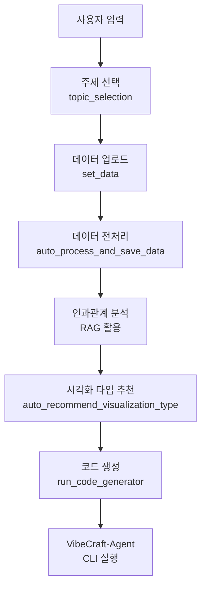

# VibeCraft-Code 설치 및 검증 보고서

**작성일**: 2025-10-18
**환경**: macOS (Darwin 24.6.0)
**검증자**: Claude Code Agent

---

## 1. 환경 확인 결과

### ✅ 필수 도구 설치 상태

| 도구 | 버전 | 요구사항 | 상태 |
|------|------|----------|------|
| Python | 3.13.4 | ≥ 3.10 | ✅ 충족 |
| uv | 0.8.0 | - | ✅ 설치됨 |
| Node.js | 22.16.0 | ≥ 18 | ✅ 충족 |
| npm | 10.9.2 | - | ✅ 설치됨 |
| vibecraft-agent | 1.0.7 | - | ✅ 설치됨 |

---

## 2. 설치 과정 검증

### 2.1 가상환경 생성
```bash
uv venv --python=python3.12
```
- **결과**: Python 3.12.11 가상환경 생성 성공
- **경로**: `.venv/`

### 2.2 의존성 설치
```bash
source .venv/bin/activate
uv sync
```
- **결과**: 165개 패키지 설치 성공
- **소요시간**: 약 6초
- **주요 패키지**:
  - langchain 0.3.26
  - chromadb 1.1.1
  - sentence-transformers 5.1.1
  - mcp[cli] 1.12.1
  - anthropic, google-generativeai, openai 관련 패키지

### 2.3 설정 파일 수정

#### `config-development.yml` 수정 사항
**변경 전** (Windows 경로):
```yaml
resource:
  data: "C:/Users/Administrator/Desktop/Aircok/vibecraft-code/storage"
  mcp: "C:/Users/Administrator/Desktop/Aircok/vibecraft-code/mcp_agent/servers"
```

**변경 후** (Mac 경로):
```yaml
resource:
  data: "/Users/infograb/Workspace/Personal/Competitions/vibecraft-code/storage"
  mcp: "/Users/infograb/Workspace/Personal/Competitions/vibecraft-code/mcp_agent/servers"
```

#### `.env` 파일 생성
```bash
# 템플릿 생성
OPENAI_API_KEY=YOUR_OPENAI_KEY_HERE
ANTHROPIC_API_KEY=YOUR_ANTHROPIC_KEY_HERE
GEMINI_API_KEY=YOUR_GEMINI_KEY_HERE
GOOGLE_API_KEY=YOUR_GOOGLE_KEY_HERE
```

---

## 3. 프로젝트 구조 분석

### 3.1 디렉토리 구조
```
vibecraft-code/
├── mcp_agent/          # AI 엔진 및 클라이언트
│   ├── client/         # VibeCraftClient, VibeCraftAgentRunner
│   ├── engine/         # Claude, Gemini, OpenAI 엔진
│   └── schemas/        # 데이터 스키마
├── services/           # RAG 엔진 등 서비스
│   └── data_processing/
│       ├── rag_engine.py
│       └── rag/
├── utils/              # 유틸리티 함수
├── storage/            # 데이터 저장소
│   └── documents/      # RAG용 문서
├── samples/            # 샘플 데이터
│   └── sample.csv
├── config-development.yml
└── main.py
```

### 3.2 코드 아키텍처 분석

#### VibeCraftClient 파이프라인


#### 엔진 선택
- **ClaudeEngine**: Anthropic Claude (claude-3-5-sonnet-20241022)
- **GeminiEngine**: Google Gemini (gemini-2.5-flash) - 기본값
- **OpenAIEngine**: OpenAI GPT (gpt-4.1)

---

## 4. 발견된 문제점

### 🔴 심각 (Critical)

#### 4.1 MCP 서버 디렉토리 미존재
- **위치**: `mcp_agent/servers/`
- **문제**: config에서 참조하지만 디렉토리가 존재하지 않음
- **영향**: `topic_mcp_server`, `set_data_mcp_server`가 None으로 초기화됨
- **코드 상태**: `TODO: WIP`로 표시됨
- **해결 방안**:
  ```bash
  mkdir -p mcp_agent/servers
  ```
  또는 MCP 서버 구현 완료 후 추가

#### 4.2 API 키 미설정
- **파일**: `.env`
- **문제**: 모든 API 키가 템플릿 값으로 되어 있음
- **필수 키**: 최소한 `GEMINI_API_KEY` 필요 (기본 엔진)
- **해결 방안**: 실제 API 키로 교체 필요

### 🟡 경고 (Warning)

#### 4.3 하드코딩된 Windows 경로
- **파일**:
  - `config-development.yml` (✅ 수정 완료)
  - `services/data_processing/rag_engine.py:184`
- **문제**: Windows 절대 경로 하드코딩
  ```python
  rag_engine.add_documents_from_directory("C:/Users/Administrator/Desktop/Aircok/ffdm-be/storage/documents")
  ```
- **해결 방안**: 설정 파일 또는 상대 경로 사용

#### 4.4 Python 버전 불일치
- **pyproject.toml**: `requires-python = ">=3.10"`
- **README.md**: `uv venv --python=python3.12` 명시
- **실제 설치**: Python 3.12.11 사용
- **문제**: 문서와 실제 요구사항 불일치
- **영향**: 미미 (3.10 이상이면 작동)

### 🔵 개선 필요 (Enhancement)

#### 4.5 README 의존성 설치 명령어 중복
README에 개별 패키지 설치 명령어가 나열되어 있지만, `pyproject.toml`과 `uv.lock`이 있으므로 `uv sync` 한 번으로 충분합니다.

**현재 README**:
```bash
uv add mcp[cli]
uv add langchain langchain-google-genai google-generativeai langchain-anthropic
uv add langchain_community
# ... 등등 많은 명령어
```

**권장 방법**:
```bash
uv sync  # 모든 의존성 자동 설치
```

#### 4.6 gemini-cli 설치 누락
README에 `npm install -g @google/gemini-cli` 명시되어 있으나, 이것이 필수인지 선택사항인지 불명확합니다.

---

## 5. 실행 가능성 평가

### 5.1 현재 상태
| 구성 요소 | 상태 | 비고 |
|----------|------|------|
| Python 환경 | ✅ | 3.12.11, 가상환경 활성화 |
| 의존성 패키지 | ✅ | 165개 패키지 설치 완료 |
| 설정 파일 | ✅ | Mac 경로로 수정 완료 |
| API 키 | ⚠️ | 템플릿만 있음, 실제 키 필요 |
| MCP 서버 | ⚠️ | WIP 상태, 현재는 None |
| VibeCraft-Agent | ✅ | 1.0.7 설치 완료 |
| 샘플 데이터 | ✅ | sample.csv 존재 |

### 5.2 실행 전 필수 작업
1. **API 키 설정** (필수)
   ```bash
   # .env 파일 편집
   GEMINI_API_KEY=실제_키_입력
   ```

2. **MCP 서버 디렉토리 생성** (선택)
   ```bash
   mkdir -p mcp_agent/servers
   ```

---

## 6. 개선 제안

### 6.1 즉시 적용 가능한 개선사항

#### A. README 업데이트
```markdown
## 🛠 환경 설정 (간소화)

### 1. 저장소 클론
git clone https://github.com/vibecraft25/vibecraft-code.git
cd vibecraft-code

### 2. uv 설치 (Python 패키지 매니저)
# macOS/Linux
curl -LsSf https://astral.sh/uv/install.sh | sh

### 3. 가상환경 생성 및 의존성 설치
uv venv --python=python3.12
source .venv/bin/activate  # macOS/Linux
uv sync  # 모든 의존성 자동 설치

### 4. 환경 변수 설정
cp .env.example .env  # 템플릿 복사
# .env 파일을 열어 실제 API 키 입력

### 5. 설정 파일 수정
# config-development.yml에서 경로를 본인 환경에 맞게 수정
```

#### B. 경로 자동 감지 유틸리티
```python
# utils/path_utils.py 개선
import os
from pathlib import Path

def get_project_root() -> Path:
    """프로젝트 루트 디렉토리 자동 감지"""
    return Path(__file__).parent.parent

def get_storage_path() -> Path:
    """storage 디렉토리 경로 반환"""
    return get_project_root() / "storage"

def get_mcp_servers_path() -> Path:
    """MCP 서버 디렉토리 경로 반환"""
    return get_project_root() / "mcp_agent" / "servers"
```

#### C. .env.example 파일 생성
```bash
# .env.example
# VibeCraft API Keys
# 이 파일을 .env로 복사하고 실제 API 키로 교체하세요

OPENAI_API_KEY=your_openai_api_key_here
ANTHROPIC_API_KEY=your_anthropic_api_key_here
GEMINI_API_KEY=your_gemini_api_key_here
GOOGLE_API_KEY=your_google_api_key_here
```

#### D. config-development.yml 개선
```yaml
version:
  server: "1.0.0"

resource:
  # 상대 경로 사용 (크로스 플랫폼 호환)
  data: "./storage"
  mcp: "./mcp_agent/servers"

path:
  chat: "./chat-data"
  file: "./data-store"
  chroma: "./chroma-db"

log:
  path: "./vibecraft-app-python-log"
```

### 6.2 장기 개선사항

#### A. 플랫폼 자동 감지
- OS 자동 감지 후 경로 구분자 자동 선택
- Windows/Mac/Linux 호환성 테스트

#### B. 설정 검증 스크립트
```python
# scripts/verify_setup.py
"""설치 및 설정 검증 스크립트"""
def verify_installation():
    checks = {
        "Python version": check_python_version(),
        "Virtual environment": check_venv(),
        "Dependencies": check_dependencies(),
        "API keys": check_api_keys(),
        "Config file": check_config(),
        "Directories": check_directories(),
    }
    # 결과 출력 및 문제 해결 방법 제시
```

#### C. Docker 지원
```dockerfile
# Dockerfile
FROM python:3.12-slim
WORKDIR /app
COPY . .
RUN curl -LsSf https://astral.sh/uv/install.sh | sh
RUN uv sync
CMD ["python", "main.py"]
```

---

## 7. 테스트 시나리오

### 7.1 기본 실행 테스트 (API 키 필요)
```bash
# 가상환경 활성화
source .venv/bin/activate

# 프로그램 실행
python main.py

# 예상 입력:
# 주제: 피자 일매출을 시각화하는 페이지를 제작할거야
# 파일 경로: ./samples/sample.csv
```

### 7.2 RAG 엔진 테스트
```python
from services.data_processing.rag_engine import RAGEngine

# RAG 엔진 초기화
rag = RAGEngine(collection_name="test", persist_directory="./test-chroma")

# 문서 추가
rag.add_documents_from_directory("./storage/documents")

# 검색 테스트
results = rag.search("판매 추세", k=3)
for r in results:
    print(f"파일: {r.file_path}, 점수: {r.score}")
```

---

## 8. 결론

### ✅ 긍정적인 부분
1. **패키지 관리**: `uv`와 `pyproject.toml`을 사용한 현대적인 의존성 관리
2. **구조화된 코드**: 명확한 모듈 분리 및 아키텍처
3. **크로스 플랫폼 고려**: VibeCraftAgentRunner에서 Windows/Unix 모두 지원
4. **완전한 의존성**: 모든 필요 패키지가 정의되어 있음
5. **문서화**: 상세한 README 및 주석

### ⚠️ 주의사항
1. **API 키 필수**: Gemini API 키 없이는 실행 불가
2. **MCP 서버 미구현**: 일부 기능이 WIP 상태
3. **경로 하드코딩**: 일부 코드에서 개선 필요
4. **크로스 플랫폼 테스트**: Mac에서만 검증됨

### 🎯 최종 평가
**실행 가능성**: ⭐⭐⭐⭐☆ (4/5)
**설치 편의성**: ⭐⭐⭐⭐☆ (4/5)
**코드 품질**: ⭐⭐⭐⭐☆ (4/5)
**문서화**: ⭐⭐⭐⭐☆ (4/5)

**권장 사항**: API 키 설정 후 즉시 사용 가능. 제안된 개선사항 적용 시 더욱 안정적인 운영 가능.

---

## 9. 빠른 시작 가이드 (Mac)

```bash
# 1. 프로젝트 이동
cd /Users/infograb/Workspace/Personal/Competitions/vibecraft-code

# 2. 가상환경 활성화
source .venv/bin/activate

# 3. API 키 설정 (필수!)
# .env 파일을 열어 GEMINI_API_KEY 입력
nano .env

# 4. 프로그램 실행
python main.py

# 5. 입력 예시
# 주제: 피자 일매출을 시각화하는 페이지를 제작할거야
# 파일 경로: ./samples/sample.csv
```

**다음 단계**: API 키 입력 후 실제 실행 테스트 및 결과 검증
